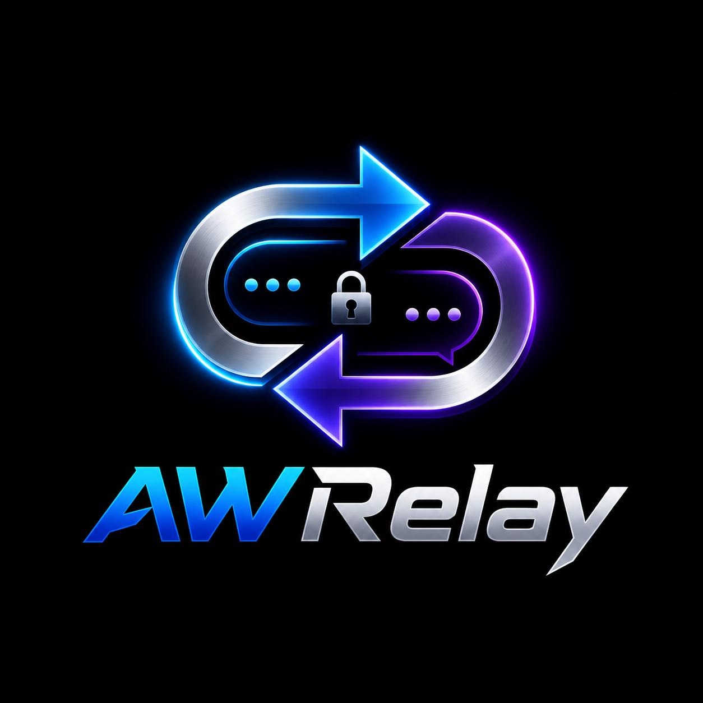

<div align="center">
  

  <h1>AWRelay</h1>

  <p>轻量、自托管的 Telegram 私聊消息中转机器人</p>
</div>

---

## 简介

AWRelay 是一个基于 [python-telegram-bot](https://github.com/python-telegram-bot/python-telegram-bot) 的私聊转发机器人。它在陌生用户与管理员之间建立一条匿名、双向的消息通道：用户私聊机器人发送的内容会被转达给管理员，管理员只需直接回复对应消息，回复内容便会原样送回该用户。整个过程中双方互不可见对方的会话入口，适合用作公开的联系入口、反馈收集、客服接待等场景。

转发基于 Telegram 的 `copy_message` 实现，因此消息不会显示「转发自」来源标签，也不受用户隐私设置的限制。机器人内置了人机验证、广告关键词过滤、黑名单与限流等多重防护，可在运行时通过控制面板动态调整，无需重启。

## 功能特性

- 双向转发：用户的文本、图片、视频、文件、贴纸、语音等各类消息均可转达给管理员；管理员回复即回传，全程匿名。
- 来源信息：每条转发都会附带发送者卡片，包含可点击的姓名超链接（点击直接打开对方资料）与数字 ID，便于识别与执行管理操作。
- 人机验证：陌生用户首次私聊需完成一道数学题（内联按钮）方可放行，验证状态持久化保存，可在面板中开关。
- 广告过滤：基于关键词命中拦截垃圾消息，关键词列表支持在面板中动态增删。
- 黑名单：对任意一条转发消息执行回复指令即可拉黑或解封对应用户。
- 限流保护：针对单个用户采用滑动窗口限流，防止短时间刷屏。
- 相册聚合：用户一次发送的多张图片会被聚合为一组，仅提示一次来源后整组转发。
- 启动提醒：机器人成功上线后会主动向管理员推送一条包含运行信息的通知。
- 自动清理：定期清理过期的消息映射记录，控制数据库体积。
- 单实例锁：通过文件锁防止同一 Token 被多个进程同时轮询而导致消息重复。

## 管理员指令

| 指令 | 说明 |
| --- | --- |
| `/menu` | 打开控制面板，管理广告拦截、人机验证开关与关键词列表 |
| `/ban` | 回复某条转发消息以拉黑该发送者 |
| `/unban` | 回复某条转发消息以解除拉黑 |
| `/cancel` | 取消当前正在进行的关键词输入操作 |
| `/help` | 显示帮助信息 |

回复用户的方式：在与机器人的对话中，直接对收到的转发消息执行「回复」，机器人便会将你的回复内容转达给对应用户。普通用户仅可见 `/start` 与 `/help` 两条基础指令。

## 配置项

机器人通过环境变量读取配置，三项变量含义如下：

| 变量 | 必填 | 说明 |
| --- | --- | --- |
| `BOT_TOKEN` | 是 | 机器人的 API Token，从 [@BotFather](https://t.me/BotFather) 获取 |
| `ADMIN_ID` | 是 | 管理员的 Telegram 数字 ID，从 [@userinfobot](https://t.me/userinfobot) 获取 |
| `PROXY_URL` | 否 | 代理地址，支持 `http://` 与 `socks5://`，能直连 Telegram 时留空 |

配置方式取决于部署形式：本地运行使用 `.env` 文件；Docker 部署直接在 `docker-compose.yml` 的 `environment` 中声明。两者择一即可，详见下方部署说明。

## 部署方式

### Docker Compose（推荐）

仓库已提供 `docker-compose.yml`，并通过 GitHub Actions 自动构建并发布多架构镜像（`linux/amd64` 与 `linux/arm64`）至 Docker Hub。

第一步，编辑 `docker-compose.yml`，将 `environment` 中的占位值替换为你的实际配置：

```yaml
environment:
  - BOT_TOKEN=你的BotToken
  - ADMIN_ID=你的管理员数字ID
  - PROXY_URL=
```

第二步，拉取镜像并启动：

```bash
docker compose pull              # 拉取最新镜像
docker compose up -d             # 后台启动
docker compose logs -f           # 查看实时日志
docker compose down              # 停止并移除容器
```

数据库与日志持久化在挂载目录（默认 `/data/AWRelay/data` 对应容器内的 `/app/data`），容器重建不会丢失数据。镜像通过启动脚本在运行时自动校正该目录的属主，因此无需手动调整宿主机目录权限。

### 本地运行

适合开发调试。需要 Python 3.11 及以上版本：

```bash
pip install -r requirements.txt
cp .env.example .env             # 复制模板后填入 BOT_TOKEN 与 ADMIN_ID
python main.py
```

本地运行时数据持久化在项目下的 `./data` 目录。

## 关于代理

当部署环境无法直连 Telegram 时，需要配置 `PROXY_URL`。在容器中使用代理有一个常见误区：容器内的 `127.0.0.1` 指向容器自身，而非宿主机，直接填写会导致连接失败。正确做法如下：

- Linux 服务器：`docker-compose.yml` 已采用 `network_mode: host`，容器与宿主机共用网络栈，可直接填写宿主机本地代理，如 `http://127.0.0.1:7890`。
- Docker Desktop（Windows / macOS）：`host` 网络模式不生效，需改用 `http://host.docker.internal:7890` 指向宿主机。
- 本地运行：直接填写本机代理地址即可，如 `http://127.0.0.1:7890`。

此外，部分代理软件（如 Clash）默认仅监听 `127.0.0.1`，若容器需经宿主机局域网 IP 访问，请在代理软件中开启「允许局域网连接」。

## 关于图标

`logo.png` 为项目图标，可作为机器人头像使用。Telegram 不支持通过 API 设置头像，请在 [@BotFather](https://t.me/BotFather) 中对你的机器人执行 `/setuserpic` 并上传该图片。

## 项目结构

```
main.py             机器人主逻辑、消息处理与指令注册
database.py         SQLite 数据访问层，采用 WAL 模式与单连接加线程锁
entrypoint.sh       容器启动脚本，校正数据目录权限后降权运行
Dockerfile          镜像构建定义，以非特权用户运行
docker-compose.yml  容器编排配置
requirements.txt    Python 依赖清单
.env.example        本地运行的配置模板
logo.png            项目图标
```

## 技术说明

- 转发采用 `copy_message`，不显示来源标签，不受隐私设置影响，并在数据库中维护转发消息与原始消息的映射关系，使管理员的回复能够准确回传到对应用户。
- 数据库使用 SQLite 并启用 WAL 模式，通过全局单连接配合线程锁，在异步事件循环之外安全地执行读写。
- 容器以 root 启动入口脚本，在运行时将挂载的数据目录属主校正给运行用户，再通过 `gosu` 降权，从而做到无论宿主机目录属主如何都能开箱即用。

## 许可证

本项目以仓库根目录的许可证文件为准。
